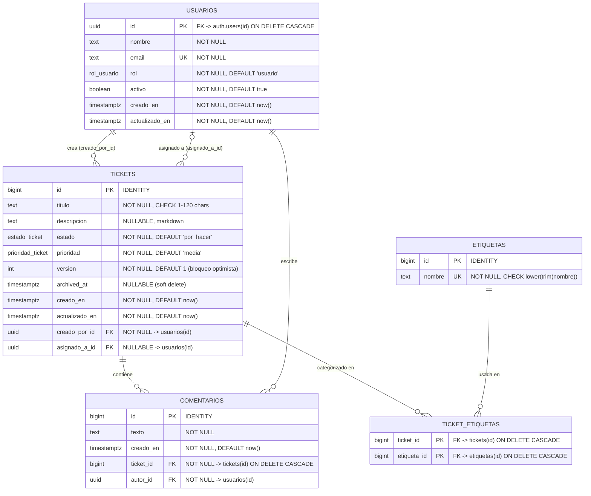

# Base de Datos — Mini Jira v1.0

Documentación generada a partir de `backend/database-schema.yaml`, `docs/init_db.sql` y `docs/er_diagram.mermaid`.

> **Nota de fuente de verdad:** `docs/init_db.sql` es el script realmente ejecutado contra Supabase/PostgreSQL 16 y refleja el estado actual de la base de datos. `backend/database-schema.yaml` documenta el diseño original (incluye una tabla `refresh_tokens` para JWT propio) que fue **superado** por la migración a Supabase Auth: la gestión de sesiones/refresh tokens ahora la realiza Supabase Auth internamente y **no existe una tabla `refresh_tokens` en el esquema real**. Este documento describe el esquema real (`init_db.sql`) y anota las diferencias de diseño donde corresponde.

---

## 1. Diagrama ERD (Mermaid)

### Enums

| Enum | Valores | Notas |
|---|---|---|
| `rol_usuario` | `admin`, `usuario` | Solo dos roles en V1; permisos granulares viven en middleware/API y RLS. |
| `estado_ticket` | `por_hacer`, `en_progreso`, `bloqueado`, `listo` | Transición libre entre estados en V1. |
| `prioridad_ticket` | `alta`, `media`, `baja` | Default `'media'`. |

---

## 2. Tablas: columnas clave, tipos y constraints

### `usuarios`

| Columna | Tipo | Constraints |
|---|---|---|
| `id` | UUID | **PK**, `REFERENCES auth.users(id) ON DELETE CASCADE` |
| `nombre` | TEXT | NOT NULL |
| `email` | TEXT | NOT NULL, **UNIQUE** |
| `rol` | `rol_usuario` | NOT NULL, DEFAULT `'usuario'` |
| `activo` | BOOLEAN | NOT NULL, DEFAULT `true` |
| `creado_en` | TIMESTAMPTZ | NOT NULL, DEFAULT `now()` |
| `actualizado_en` | TIMESTAMPTZ | NOT NULL, DEFAULT `now()`, actualizado por trigger |

RLS habilitado. Políticas: lectura abierta a `authenticated`; insert solo admin (alta normal vía trigger `handle_new_auth_user` en `auth.users`); update por admin (cualquier fila) o por el propio usuario (solo su fila, y no puede auto-asignarse admin).

### `tickets`

| Columna | Tipo | Constraints |
|---|---|---|
| `id` | BIGINT (IDENTITY) | **PK** |
| `titulo` | TEXT | NOT NULL, `CHECK (char_length(titulo) BETWEEN 1 AND 120)` |
| `descripcion` | TEXT | NULLABLE (markdown) |
| `estado` | `estado_ticket` | NOT NULL, DEFAULT `'por_hacer'` |
| `prioridad` | `prioridad_ticket` | NOT NULL, DEFAULT `'media'` |
| `version` | INTEGER | NOT NULL, DEFAULT `1` — bloqueo optimista |
| `archived_at` | TIMESTAMPTZ | NULLABLE — soft delete (NULL = activo) |
| `creado_en` | TIMESTAMPTZ | NOT NULL, DEFAULT `now()` |
| `actualizado_en` | TIMESTAMPTZ | NOT NULL, DEFAULT `now()`, actualizado por trigger |
| `creado_por_id` | UUID | **FK** NOT NULL → `usuarios(id)` |
| `asignado_a_id` | UUID | **FK** NULLABLE → `usuarios(id)` |

RLS habilitado. Lectura abierta a `authenticated`. Insert: solo el propio `creado_por_id = auth.uid()` y usuario `activo = true`. Update: admin (cualquier ticket) o el creador para su propio ticket (no-admin). No hay política de DELETE físico: el archivado es un `UPDATE` de `archived_at`.

Índices: `idx_tickets_creado_por`, `idx_tickets_asignado_a`, `idx_tickets_estado`, `idx_tickets_prioridad`, e índice parcial `idx_tickets_activos (estado, prioridad) WHERE archived_at IS NULL` para el tablero activo.

### `comentarios`

| Columna | Tipo | Constraints |
|---|---|---|
| `id` | BIGINT (IDENTITY) | **PK** |
| `texto` | TEXT | NOT NULL (1–5000 chars, validado en API) |
| `creado_en` | TIMESTAMPTZ | NOT NULL, DEFAULT `now()` |
| `ticket_id` | BIGINT | **FK** NOT NULL → `tickets(id) ON DELETE CASCADE` |
| `autor_id` | UUID | **FK** NOT NULL → `usuarios(id)` |

RLS habilitado. Lectura abierta. Insert: `autor_id = auth.uid()` y usuario activo. Delete: admin borra cualquiera; usuario solo el propio. Sin política de UPDATE (no hay edición de comentarios en V1). Índices: `idx_comentarios_ticket`, `idx_comentarios_autor`.

### `etiquetas`

| Columna | Tipo | Constraints |
|---|---|---|
| `id` | BIGINT (IDENTITY) | **PK** |
| `nombre` | TEXT | NOT NULL, **UNIQUE**, `CHECK (nombre = lower(trim(nombre)))` |

RLS habilitado. Lectura abierta; insert permitido a cualquier usuario activo (creación on-demand).

### `ticket_etiquetas` (pivot N:M)

| Columna | Tipo | Constraints |
|---|---|---|
| `ticket_id` | BIGINT | **PK compuesta**, FK → `tickets(id) ON DELETE CASCADE` |
| `etiqueta_id` | BIGINT | **PK compuesta**, FK → `etiquetas(id) ON DELETE CASCADE` |

RLS habilitado. Lectura abierta. Insert/Delete restringidos al creador del ticket o a un admin. Trigger `trg_max_etiquetas` impide más de 5 filas por `ticket_id`.

### `refresh_tokens` (diseño original, no presente en el esquema real)

Documentada en `backend/database-schema.yaml` como parte del diseño de autenticación propia con JWT (columnas `usuario_id`, `token_hash`, `revocado`, `expira_en`). Tras la migración a Supabase Auth (`auth.users` + `handle_new_auth_user`), esta tabla **ya no se crea**: Supabase gestiona sesiones y refresh tokens internamente. Se documenta aquí únicamente por trazabilidad histórica del diseño.

---

## 3. Funciones y triggers

| Nombre | Tipo | Tabla / evento | Propósito |
|---|---|---|---|
| `is_admin()` | Función `SECURITY DEFINER` | — | Determina si `auth.uid()` corresponde a un usuario con `rol = 'admin'` y `activo = true`; usada en políticas RLS. |
| `handle_new_auth_user()` / `trg_new_auth_user` | Trigger | `AFTER INSERT ON auth.users` | Crea automáticamente la fila correspondiente en `usuarios` al registrarse un usuario en Supabase Auth. |
| `increment_ticket_version()` / `trg_tickets_version` | Trigger | `BEFORE UPDATE ON tickets` | Incrementa `version` en cada `UPDATE`, habilitando el bloqueo optimista (`WHERE id = X AND version = N`). |
| `set_actualizado_en()` / `trg_usuarios_actualizado_en`, `trg_tickets_actualizado_en` | Trigger | `BEFORE UPDATE` en `usuarios` y `tickets` | Actualiza `actualizado_en = NOW()` en cada modificación. |
| `check_max_etiquetas()` / `trg_max_etiquetas` | Trigger | `BEFORE INSERT ON ticket_etiquetas` | Impide insertar una 6ª etiqueta para el mismo ticket (`RAISE EXCEPTION`). |

---

## 4. Decisiones de diseño documentadas

### Soft delete vía `archived_at`

- `tickets.archived_at` es `TIMESTAMPTZ NULLABLE`: `NULL` significa ticket activo; un valor no nulo es la fecha de archivado.
- No existe borrado físico (`DELETE`) para tickets: el "archivado" se implementa como `UPDATE tickets SET archived_at = NOW()`.
- Una vez archivado, el ticket es de solo lectura; solo un Admin puede restaurarlo (`archived_at = NULL`).
- Los tickets archivados quedan excluidos del tablero principal y de las métricas del dashboard.
- Para `usuarios` el mecanismo análogo es la columna `activo` (boolean) en lugar de un timestamp: `activo = false` desactiva la cuenta sin eliminarla, evitando romper las referencias (`creado_por_id`, `asignado_a_id`, `autor_id`) que exige la integridad referencial.
- Deliberadamente no se usa una columna genérica `deleted_at` en todas las tablas: cada entidad tiene el mecanismo de soft-delete que corresponde a su semántica de negocio (booleano para cuentas de usuario, timestamp para tickets).

### Pessimistic Lock (`ticket_locks`)

- El esquema documentado (`backend/database-schema.yaml`) y el script `init_db.sql` **no implementan bloqueo pesimista** ni una tabla `ticket_locks`; el mecanismo de concurrencia elegido para V1 es **bloqueo optimista** mediante la columna `tickets.version`.
- Flujo de bloqueo optimista:
  1. El cliente recibe un ticket con `version = N`.
  2. Envía `PATCH` con `{ version: N, ...cambios }`.
  3. El servidor ejecuta `UPDATE tickets SET ..., version = N+1 WHERE id = :id AND version = N` (el incremento real ocurre vía el trigger `trg_tickets_version`).
  4. Si `rows_affected = 0`, otro proceso ya modificó el ticket → la API responde `409 version_conflict` y no persiste ningún cambio.
  5. Si `rows_affected = 1`, éxito; se devuelve el ticket con la nueva versión.
- No se documenta ni se requiere una tabla `ticket_locks` para V1; el bloqueo optimista basado en `version` cubre el caso de uso (equipos pequeños, baja probabilidad de escritura concurrente sobre el mismo ticket).

### AuditLog inmutable (sin UPDATE/DELETE)

- El esquema actual **no incluye una tabla de auditoría** (`design_notes.out_of_scope_v1` en `backend/database-schema.yaml` enumera explícitamente "Historial de cambios de estado (audit log)" como fuera de alcance en V1).
- El principio de inmutabilidad sí se aplica, en cambio, a otras entidades con semántica de "hecho consumado":
  - `comentarios.creado_en` es inmutable (no hay `UPDATE` de comentarios; solo `INSERT` y `DELETE` físico, ver política `comentarios: borrar (admin)` / `comentarios: borrar propio`). El PRD establece "el usuario borra y reescribe" en vez de editar.
  - `usuarios.creado_en` y `tickets.creado_en` son campos de auditoría mínima, inmutables tras la creación (no expuestos a `UPDATE` desde la API).
- Si se introdujera un `audit_log` en V2, el diseño esperado (según convención del resto del esquema) sería una tabla solo de `INSERT` — sin políticas RLS de `UPDATE`/`DELETE` — para preservar un historial verdaderamente inmutable.

---

## 5. Resumen de relaciones y claves foráneas

| FK | Cardinalidad | ON DELETE | Motivo |
|---|---|---|---|
| `usuarios.id → auth.users.id` | 1:1 | CASCADE | La fila de perfil desaparece si Supabase Auth elimina la cuenta. |
| `tickets.creado_por_id → usuarios.id` | N:1 | (sin acción explícita / RESTRICT en diseño) | Evita eliminar un usuario con tickets creados; usar `activo = false`. |
| `tickets.asignado_a_id → usuarios.id` | N:1 | (nullable, sin acción explícita) | Ticket queda sin asignar si el usuario referenciado desaparece. |
| `comentarios.ticket_id → tickets.id` | N:1 | CASCADE | Los comentarios dependen del ticket. |
| `comentarios.autor_id → usuarios.id` | N:1 | (sin acción explícita / RESTRICT en diseño) | No eliminar usuarios con comentarios; usar `activo = false`. |
| `ticket_etiquetas.ticket_id → tickets.id` | N:1 | CASCADE | Asociaciones mueren con el ticket. |
| `ticket_etiquetas.etiqueta_id → etiquetas.id` | N:1 | CASCADE | Asociaciones mueren si se purga la etiqueta del catálogo. |

---

*Fuentes: `backend/database-schema.yaml`, `docs/init_db.sql`, `docs/er_diagram.mermaid`.*
