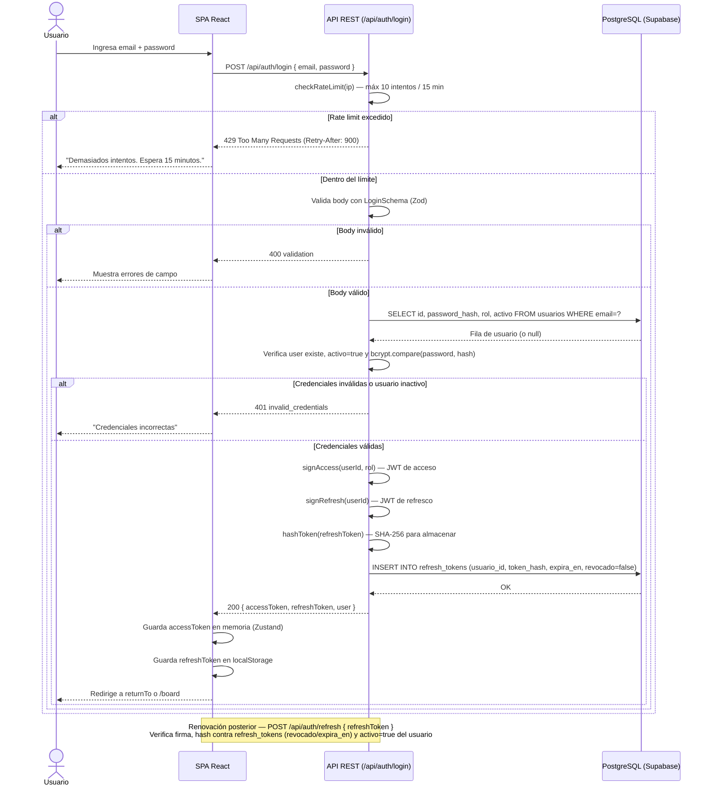
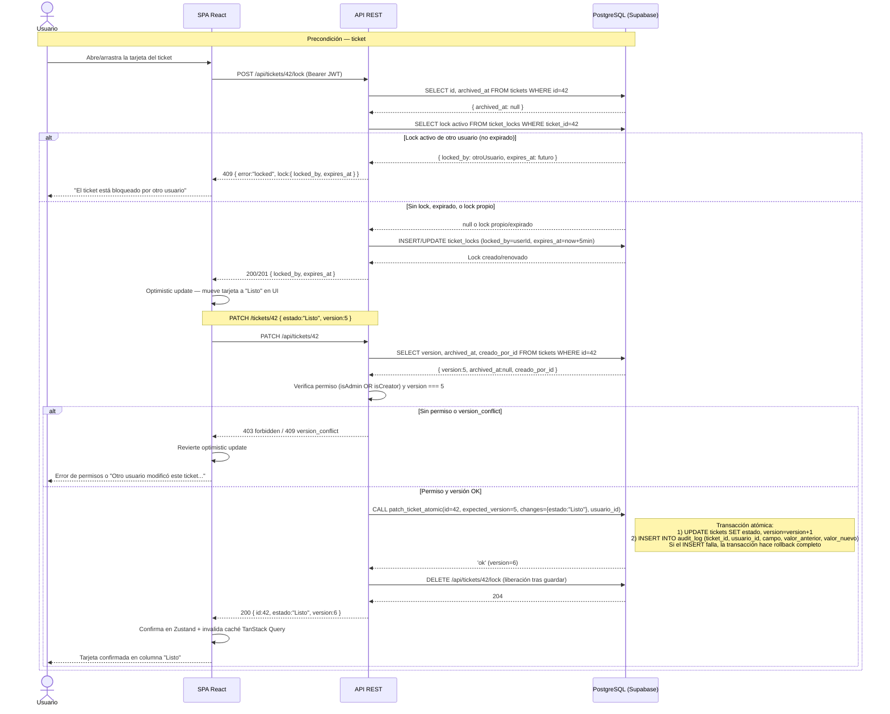
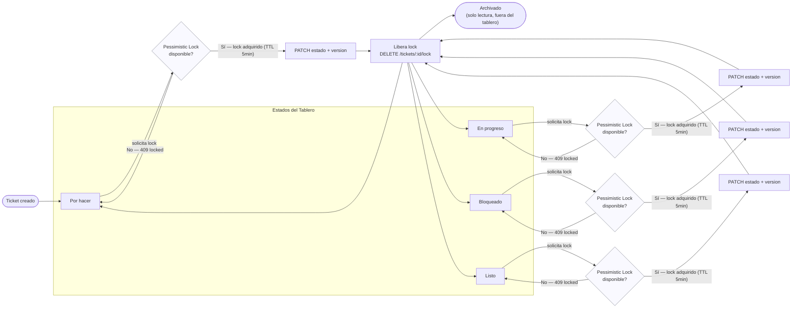

# Diagramas Técnicos — Mini Jira v1.0

Generados a partir de `backend/src/app/api/**`, `docs/architecture-c4.mermaid`,
`docs/architecture-sequence.mermaid` y `docs/specs.md`.

---

## 1. Flujo de autenticación JWT

Basado en `backend/src/app/api/auth/login/route.ts` y `backend/src/app/api/auth/refresh/route.ts`:
rate limit por IP (10 intentos / 15 min), validación con `LoginSchema` (Zod), verificación de
`activo` y `bcrypt.compare`, emisión de `accessToken` (corto) + `refreshToken` (7 días, hash
persistido en `refresh_tokens`).

---

## 2. Mover ticket entre columnas (lock pesimista + versión optimista + AuditLog)

Refleja el mecanismo real de dos capas de concurrencia implementado en el backend:

- **Lock pesimista** de edición vía `POST /api/tickets/:id/lock` y `DELETE /api/tickets/:id/lock`
  (`backend/src/app/api/tickets/[id]/lock/route.ts`), TTL de 5 minutos, liberado por el titular o un Admin.
- **Concurrencia optimista** en el `PATCH /api/tickets/:id` (`backend/src/app/api/tickets/[id]/route.ts`)
  mediante el campo `version`, resuelto de forma atómica por la función PL/pgSQL `patch_ticket_atomic`,
  la cual también inserta en `audit_log` cuando cambia `estado` (rollback automático si la inserción falla).

---

## 3. Ciclo de vida de un ticket (con Pessimistic Lock)

Estados reales definidos en `docs/specs.md §2.3`: **Por hacer**, **En progreso**, **Bloqueado**,
**Listo** (4 columnas del tablero). Las transiciones son libres — cualquier estado puede moverse a
cualquier otro en V1 (sin flujo forzado) — pero toda edición pasa primero por la adquisición del
lock pesimista (`POST /tickets/:id/lock`) antes de intentar el cambio, y por su liberación
(`DELETE /tickets/:id/lock`) al finalizar o expirar el TTL de 5 minutos.

> Nota: las transiciones entre `TODO`, `PROGRESS`, `BLOCKED` y `DONE` son todas-a-todas (sin flujo
> forzado, ver `specs.md` línea 81). El archivado (`archived_at != null`) es un estado terminal de
> solo lectura que saca al ticket del tablero principal y de las métricas del dashboard.
